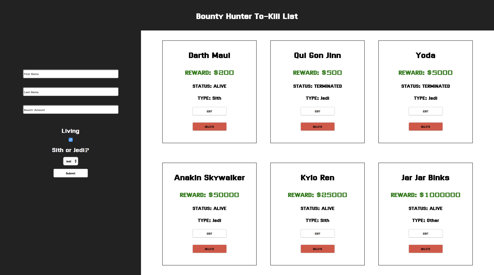
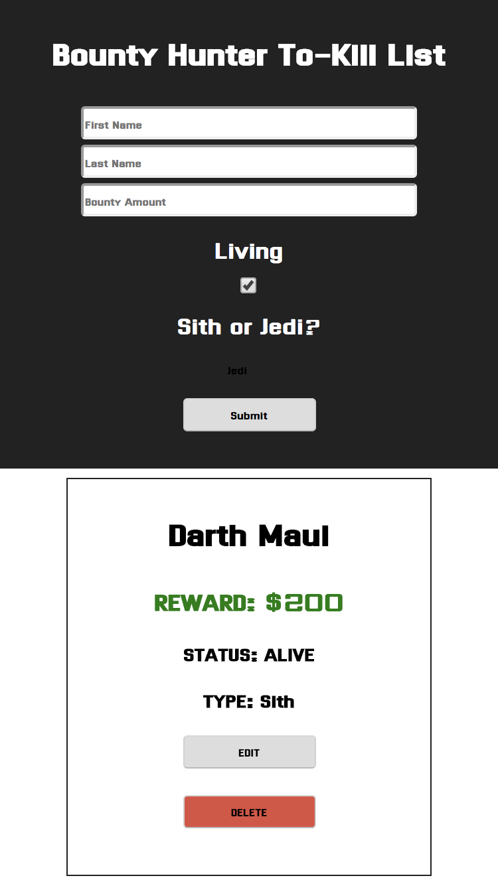

## Bounty Hunter

Celeste Robinson

## Objective

Build a full stack API that uses all CRUD requests. The user should be able to get, add, update and delete each individual bounties. When the app loads, app automatically makes a request to my server to ```GET``` a list of all existing bounties from my database. The main focus for this project was the backend. I built the frontend as well as the server and the database using Express, MongoDB, and Mongoose, thus creating my first full stack project.

### Web View


### Mobile View


## Links

GitHub Repository: https://github.com/celesterobinson/bounty-hunter

## Technologies Used
* HTML, CSS, React, Redux + Thunk, JavaScript, Axios
* Express + Middleware, MongoDB, Mongoose

## Code Examples

Because this was my first full stack project, I used a simple UI and focused more on getting comfortable with the Express, MongoDB, and Mongoose code. Below is a snippet of mongoose schema which is called a model. This template sets up what the database expects to see as the format for post requests from the front end. Each object inside of the newly declared schema has a type, which is the type of data. They also include whether or not that specific object requires a value to be assigned to it.

```
const bountySchema = new mongoose.Schema({
    firstName: {
        type: String,
        required: true
    },
    lastName: {
        type: String,
        required: true
    },
    bountyAmount: {
        type: Number,
        required: true
    },
    living: {
        type: Boolean,
        required: true
    }, 
    type: {
        type: String,
        required: true
    }
})
```

This next bit includes some routes. These routes tell the database what to do based on the server's request. Mongoose is WONDERFUL. It makes these routes simpler by including methods for these requests. The delete route uses ```.findByIdAndRemove``` which does exactly what it says. I pass in the id of the item that is being requested to be removed, as well as a callback function that returns an error if something goes wrong. Otherwise, it sends the response back with the bounty deleted.

```
bountyRoute.delete("/:id", (req, res)=>{
    Bounty.findByIdAndRemove(req.params.id, (err, deletedBounty)=>{
        if(err) return res.status(500).send(err);
        return res.send(deletedBounty);
    })
})
```

Again we see the use of a mongoose method. By using ```.findByIdAndUpdate``` on a ```put``` request, the servercan make request to update an item in the database, and recieve a resonse with the data updated. To make this work, the id and the ```req.body``` (from body-parser) must be passed into the method. In the callback function, the same process from delete is repeated. We provide an error if things go wrong, and then send the server the updated information.
```
bountyRoute.put("/:id", (req, res)=>{
    Bounty.findByIdAndUpdate(req.params.id, req.body, {new: true}, (err, updatedBounty)=>{
        if(err) return res.status(500).send(err);
        return res.send(updatedBounty);
    })
})
```